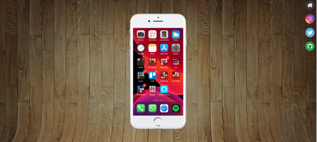
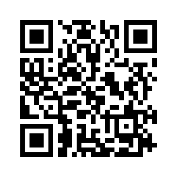

# AivanSocial

O projeto AivanSocial, teve sua origem através de um curso gratuito de HTML e CSS, fornecido pelo professor Guanabara, criador do canal Curso em vídeo

O projeto tem como objetivo, divulgar redes sociais de uma forma "diferenciada". Podemos ver que temos acesso a um celular, mas não funciona se não for através dos botões ao lado, dando assim acesso a Github, Instagram, Twitter e o Home. Cada botão é uma rede social que é possível ver através do "celular" ou pode ser acessada através de um botão no final da imagem no "celular".

## Demonstração

## 💻 Tech Stack:
  
  

## Material

https://www.youtube.com/watch?v=1kOhJr4DXIg

## Licença

[MIT License](https://choosealicense.com/licenses/mit/)

## Suporte

Para suporte, mande um email para ivan.rocha.0987@gmail.com ou entre em contato via whatsapp (41) 98468-5317.

## Feedback

Se você tiver algum feedback, por favor enviar para ivan.rocha.0987@gmail.com

## Autores

- [@IvanRocha](https://www.github.com/ivanrocha10)
- [@CursoEmVideo](https://github.com/gustavoguanabara)

## Projeto

  Acesse o "AivanSocial" pelo QR:

  

Caso o QR não funcione, acesse <a href="https://ivanrocha10.github.io/AivanSocial/">aqui</a>